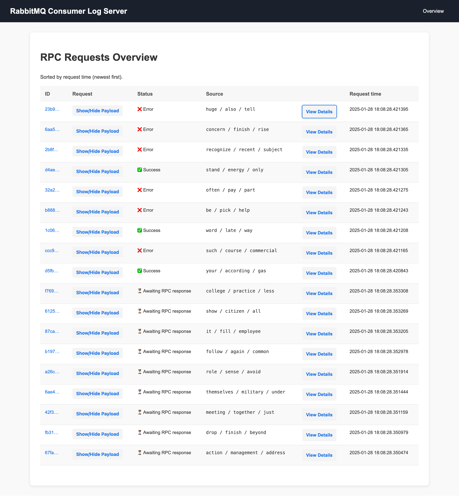
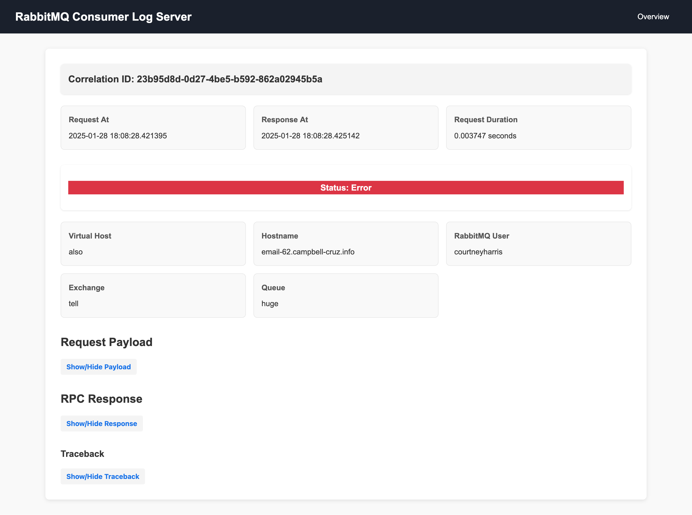

# python3-cyberfusion-rabbitmq-consumer-log-server

Log server for RabbitMQ consumer.

Use the [RabbitMQ consumer](https://github.com/CyberfusionIO/python3-cyberfusion-rabbitmq-consumer)?
The log server gives you an overview of RPC requests/responses - from all your RabbitMQ consumers - in one place.

# Install

## PyPI

Run the following command to install the package from PyPI:

    pip3 install python3-cyberfusion-rabbitmq-consumer-log-server

## Debian

Run the following commands to build a Debian package:

    mk-build-deps -i -t 'apt -o Debug::pkgProblemResolver=yes --no-install-recommends -y'
    dpkg-buildpackage -us -uc

# Configure

The log server consists of two parts: a web-based GUI, and an API.

## API

The RabbitMQ consumer writes RPC requests/responses to the API. To let the consumer ship logs to the log server, see the consumer's [README](https://github.com/CyberfusionIO/python3-cyberfusion-rabbitmq-consumer/blob/master/README.md#central-logging).

The API requires an API token, which is configured in `/etc/rabbitmq-consumer-log-server/api_token` (regular text file).

For example, you can generate a random secret using `openssl`: `openssl rand -hex 32`

You do not need to keep the API token confidential. It can be used for writing only. Therefore, abuse would be a nuisance at the worst.

## GUI

Human users use the web-based GUI to view RPC requests/responses.

The web GUI uses basic authentication. The password is configured in `/etc/rabbitmq-consumer-log-server/gui_password` (regular text file).

For example, you can generate a random secret using `openssl`: `openssl rand -hex 32`

You can use any basic authentication username - it's ignored.

# Usage

## Run

The server runs on `:::4194`.

Access the web GUI on `/rpc-requests`.

### Manually

* Run migrations: `alembic upgrade head`
* Run the app using an ASGI server such as Uvicorn.

### systemd

    systemctl start rabbitmq-consumer-log-server.service

## SSL

Use a proxy that terminates SSL. E.g. [HAProxy](http://www.haproxy.org/).

## Development

Developing the RabbitMQ consumer? Access the API documentation on `/redoc` (Redoc) and `/docs` (Swagger).
